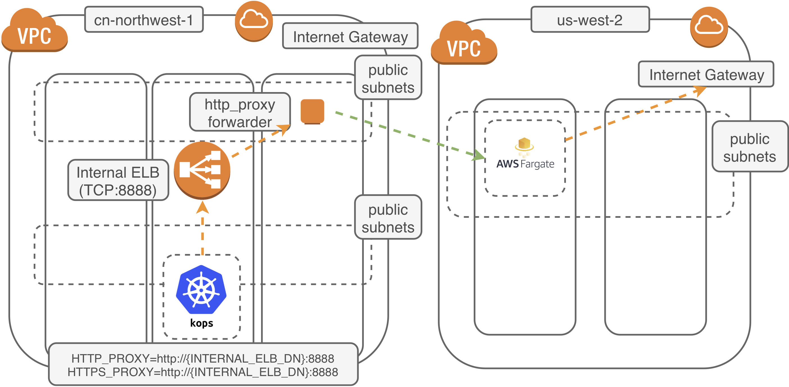

# Kops-BJS

This tutorial will walk you through building a Kubernetes cluster with [Kops](https://github.com/kubernetes/kops) in AWS Beijing or NingXia Region.

|        Name        |                     Support Kops Version                     | Support Kubernetes Version | Last Update    |
| :----------------: | :----------------------------------------------------------: | :------------------------: | -------------- |
| **pahud/kops-bjs** | [1.10.0](https://github.com/kubernetes/kops/releases/tag/1.10.0) |           1.10.3           | Aug 17th, 2018 |




### HOWTO

**Prepare the AMI** 

**Install Kops and Kubectl client on your laptop**

**Create a proxy server with gost in AWS N. Virginia Region**

**Create a proxy forwarder in AWS Beijing Region**

**Create the cluster with Kops**


### Prepare the AMI 

Check the latest AMI ID from [Kops Images](https://github.com/kubernetes/kops/blob/master/docs/images.md) document and find the AMI ID in the global regions(e.g. N. Virginia).

However, as the China Beijing region already has latest CoreOS AMI, you can just check [CoreOS official EC2 AMI page](https://coreos.com/os/docs/latest/booting-on-ec2.html) and select the AMI for `cn-north-1` region, make sure you select the `HVM` AMI type. For example, current AMI ID is **ami-0d5ec5d735beb907e** ([Container Linux 1800.7.0](https://coreos.com/os/docs/1800.7.0/index.html)). Please note the latest AMI ID may change over time.

|         Region          |        CoreOS AMI         |
| :---------------------: | :-----------------------: |
|   Beijing(cn-north-1)   | **ami-0d5ec5d735beb907e** |
| NingXia(cn-northwest-1) | **ami-02a5768104b4e8d4c** |


### Install Kops and Kubectl client on your laptop

- [install kops](https://github.com/kubernetes/kops/blob/master/docs/aws.md#install-kops)
- [install kubectl](https://github.com/kubernetes/kops/blob/master/docs/aws.md#install-kubectl)

### Create a proxy server with gost and AWS Fargate

click the button to create a proxy server with [gost](https://github.com/ginuerzh/gost) and AWS Fargate  in any of the following regions.

|           Region            |                     Launch Stack in VPC                      |   Runtime   |
| :-------------------------: | :----------------------------------------------------------: | :---------: |
|   **Oregon** (us-west-2)    | [](https://console.aws.amazon.com/cloudformation/home?region=us-west-2#/stacks/new?stackName=gost-service&templateURL=https://s3-us-west-2.amazonaws.com/pahud-cfn-us-west-2/kops-bjs/cloudformation/ecs-fargate-gost-tls-ss.yaml) | Fargate+ECS |
| **N. Virginia** (us-east-1) | [](https://console.aws.amazon.com/cloudformation/home?region=us-east-1#/stacks/new?stackName=gost-service&templateURL=https://s3-us-west-2.amazonaws.com/pahud-cfn-us-west-2/kops-bjs/cloudformation/ecs-fargate-gost-tls-ss.yaml) | Fargate+ECS |


### Create a proxy forwarder in AWS Beijing or Ningxia Region

Depending on which region you woud like to provision your Kops cluster, click the button below to create an internal **http_proxy forwarder** for your Kops cluster. This template will create one t2.micro EC2 behind ELB in your existing VPC as the proxy forwarder.


|            Region            |                     Launch Stack in VPC                      | Runtime |
| :--------------------------: | :----------------------------------------------------------: | :-----: |
|   **Beijing** (cn-north-1)   | [](https://console.amazonaws.cn/cloudformation/home?region=cn-north-1#/stacks/new?stackName=kops-proxy&templateURL=https://s3.cn-north-1.amazonaws.com.cn/kops-bjs/cloudformation/bjs.yml) | EC2+ELB |
| **NingXia** (cn-northwest-1) | [](https://console.amazonaws.cn/cloudformation/home?region=cn-northwest-1#/stacks/new?stackName=kops-proxy&templateURL=https://s3.cn-north-1.amazonaws.com.cn/kops-bjs/cloudformation/bjs.yml) | EC2+ELB |


## Fast Bootstrapping with local mirror

Depending on what region you intend to deploy your Kops, follow the `fastboot guide` below to continue your setup.

|           Region            |                            Guide                             |
| :-------------------------: | :----------------------------------------------------------: |
|   **Beijing**(cn-north-1)   | [fastboot guide](https://github.com/pahud/kops-bjs/tree/master/bjs-fastboot) |
| **NingXia**(cn-northwest-1) | [fastboot guide](https://github.com/pahud/kops-bjs/tree/master/zhy-fastboot) |

### clean up

delete the cluster

```bash
$ kops delete cluster --name cluster.bjs.k8s.local --yes
```

And delete the two cloudformation stacks from `N.Virginia` and `Beijing` regions.


## FAQ

Questions? check the [FAQ list here](https://github.com/pahud/kops-bjs/issues?utf8=%E2%9C%93&q=label%3AFAQ+).


